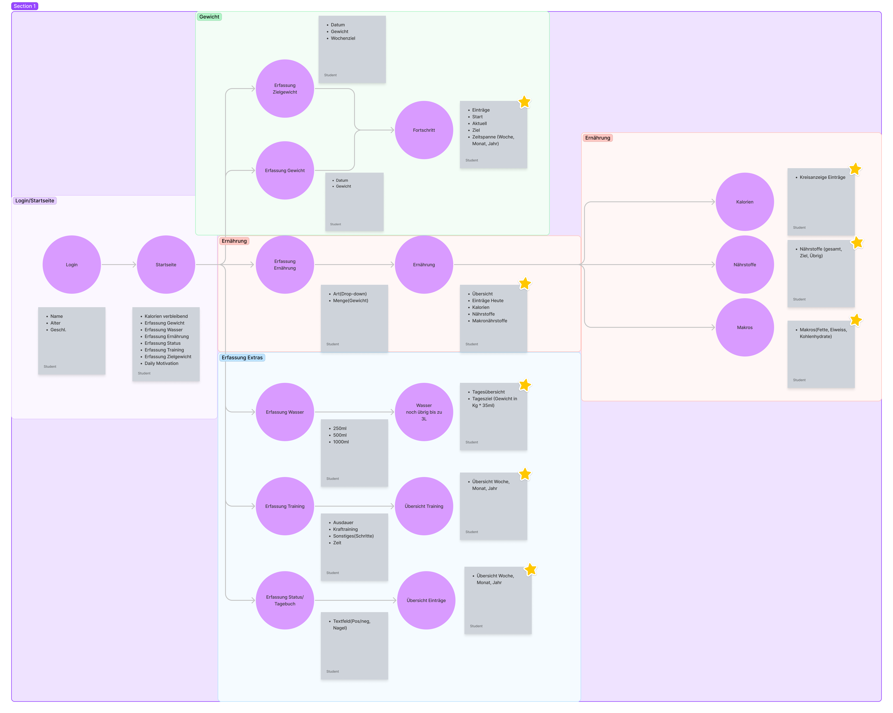
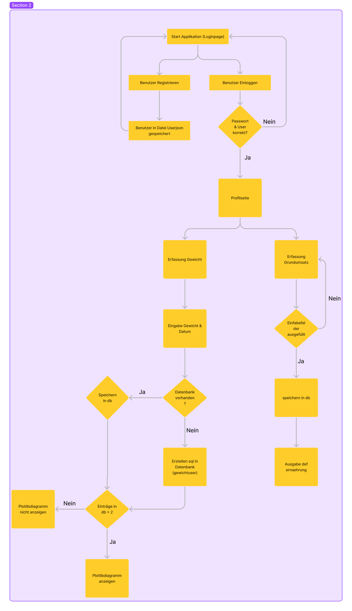

# Willkommen bei der MyBody(Fitnessapp)
### Ziel

Mit der MyBody Fitnessapp kannst du ganz einfach, dein Gewicht und deinen täglichen Kalorienverbrauch im
Auge behalten!

<!-- TABLE OF CONTENTS Quelle: https://raw.githubusercontent.com/othneildrew/Best-README-Template/master/README.md, 
Stand 14.06.20-->

  
Table of Contents

  <ol>
    <li><a href="#### Problembeschreibung/Motivation">Problembeschreibung/Motivation</a></li>
    <li><a href="#### Betrieb">Betrieb</a></li>
    <li><a href="#### Benutzung">Benutzung</a></li>
    <li><a href="#### Architektur">Architektur</a></li>
    <li><a href="#### Ungelöste/unbearbeitete Probleme">Ungelöste/unbearbeitete Probleme</a></li>
  </ol>

#### Problembeschreibung/Motivation

Jeder der viel Sport macht und täglich auf sein Gewicht und seine Kalorieneinnahme achtet, weiss wie aufwändig dies ist.
Es ist schwierig, den Überblick zu behalten betreffend Gewicht, Kalorieneinnahme und -verbrauch. Deshalb ist es 
angenehm, die Vor- und Rückschritte in einer App festhalten zu können und automatisch den Gesamtüberblick zu behalten.
Deshalb kann man in der MyBody Fitnessapp ganz einfach sein Zielgewicht erfassen und täglich sein Gewicht eintragen, um
die Gewichtsentwicklung in Richtung Zielgewicht festzuhalten. Zudem ist es möglich seinen Grundumsatz an Kalorien zu
berechnen sowie diesen an seinen Aktivitätslevel und die gesteckten Ziele(Zunahme oder Abnahme) anzupassen.

#### Betrieb

Für die Inbetriebnahme der Applikation wird zusätzlich zu Phyton noch Flask, sqlite3, datetime, benötigt. 

Wenn man den Code in Python laufenlässt, kann man über den Internetbrowser (http://127.0.0.1:5000/), welcher einem
angezeigt wird auf die Loginseite zu greiffen. Wenn man sich Registriert kann man im Feld Zielgewicht sein angestrebtes
Wunschgewicht eingeben. Achtung dies ist nur zu Beginn möglich.

#### Benutzung

Die Applikation kann nach dem erfassen eines Wunschegwichtes benutzt werden um dieses zu erreichen. EInerseits kann man
täglich sein gewogenes Gewicht eintragen und bekommt so eine Statistische Auswertung, wie sich sein Gewicht entwickelt. 
Wichtig zu erwähnen ist, dass der Anwender die Möglichkeit hat das Zeitfenster des Überblickes selbst einzustellen je
nachdem welche Zeitspanne einem interessiert.
Zusätzlich ist es möglich, dass man seinen Kalorien umsatz berechnet inklusive der Berücksichtigung seines Zieles (ZU-,
Abnahme oder Gewicht halten) sowie der sportliche Betätigung.

#### Architektur

- erster Mokup (09.04.22) in Figma erstellt und definiert, welche Teile der Applikation wie zusammen hängen.

- definitives Ablaufdiagramm (18.06.22).

#### Ungelöste/unbearbeitete Probleme

- Momentan kann man die eingetragenen sportlichen Aktivitäten nicht abspeichern und aufrechnen. Man ist gezwungen die 
verbrauchten Kalorien extern im Überblick zu behalten.
- Eine wesentliche Verbesserung wäre, wenn die oben genannten externen Rechnungen betreffend Kalorieneinahme ebenfalls
- im system abgebildet werden könnten. Sowie im ersten Mokup die Erfassung der Wassereinnahme und die Erfassung von
- sportlichen Aktivitäten ergänzt und ausgearbeitet werden würden.

